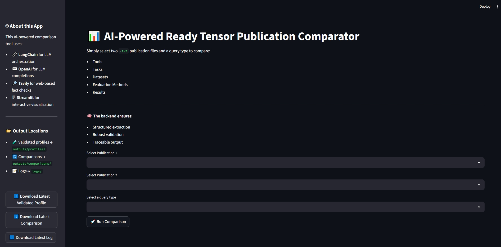
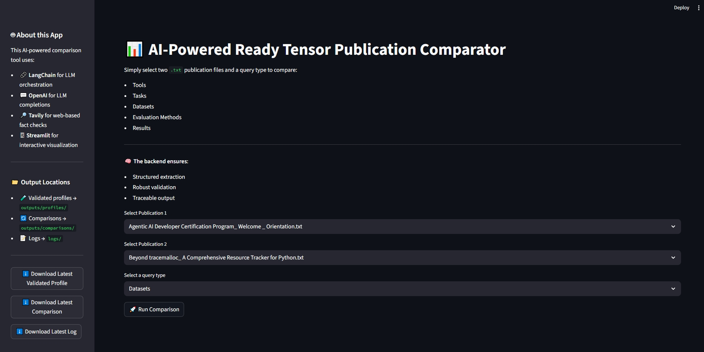
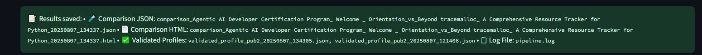

# Agentic AI Developer Certification: Production LangGraph-Orchestrated Research Assistant for Ready Tensor  

This repository is part of the **Agentic AI Developer Certification program** by [Ready Tensor](https://www.readytensor.ai). It demonstrates how to take a multi-agent system from ideation to production, focusing on robustness, safety, and deployment best practices. The project is linked to the publication **Agentic AI Developer Certification: Production LangGraph-Orchestrated Research Assistant for Ready Tensor**.

---  

## Project Description  

This project builds upon the multi-agent system (prototype) described in the publication [Agentic AI Developer Certification: LangGraph-Orchestrated Research Assistant for Ready Tensor](https://app.readytensor.ai/publications/agentic-ai-developer-certification-langgraph-orchestrated-research-assistant-for-ready-tensor-IQBETLgAsJ9X). To advance the prototype to a fully production-ready, robust, and user-friendly agentic AI system, the production-grade system includes:    

- **Guardrails**: Input/output validation, prompt protection, and structured response constraints.
- **Observability**: Logging, feedback capture, and instrumentation.
- **Deployment**: Streamlit-based app, Docker support, and cloud hosting options.
- **Documentation**: Usage guides, walkthroughs, limitations, and safety considerations.  

---  

## Features

| Area          | Tools / Practices                                    |
|---------------|------------------------------------------------------|
| Guardrails    | Input validation, LangChain parsers, file checks, Guardrails-AI |
| Observability | Python logging, node tracing, monitoring             |
| Deployment    | Streamlit Cloud, Docker, CLI runner                  |
| Documentation | README, screenshots, docstrings, diagrams            |

---

## Productionizing the Multi-Agent System

### Guardrails

[Guardrails-AI](https://hub.guardrailsai.com/) enforces structured, validated outputs from LLMs.

#### Comparison: Without vs. With Guardrails-AI

| Feature              | Without Guardrails-AI         | With Guardrails-AI                |
|----------------------|------------------------------|-----------------------------------|
| Output format        | Free-form, unstructured text  | Schema-validated JSON             |
| Input flexibility    | High                         | Moderate (requires schema)        |
| Retry on invalid     | No                           | Yes                               |
| Production-safety    | Risk of LLM drift            | Robust                            |
| Dev speed            | Fast                         | Requires setup effort             |

#### Integration Steps

1. Install `guardrails-ai`.
2. Create a `.rail` schema for publication profiling.
3. Update analysis functions (e.g., `PublicationExplorer.analyze_pub1()`, `PublicationExplorer.analyze_pub2()` in `src/explorer.py`).
4. Validate outputs before updating state.

**Validated output includes:**  
- `tools`: Frameworks/libraries extracted from publication  
- `evaluation_methods`: Metrics or strategies described  
- `datasets`: Benchmarks used  
- `task_types`: Types of tasks addressed  
- `results`: Key findings

All fields must be present for validation. Structured, machine-readable JSON enables downstream analytics and reproducibility.

---

### Observability

Observability is essential for monitoring, tracing, and debugging during real-world deployment. Logging and monitoring use Python’s logging module and node tracing.

#### Key Observability Features

| Feature         | Tool/Technique                       | Purpose                                  |
| --------------- | ------------------------------------ | ---------------------------------------- |
| Structured Logs | Python’s `logging` + JSON formatting | Centralized log collection & readability |
| Tracing         | `uuid` session ID + node info        | Track LLM invocation paths & failures    |

#### Implementation Steps

1. Install logging tools.
2. Create `logger.py`.

**Enhancements Include:**  
- Structured logging using loguru  
- Session traceability via uuid  
- Centralized logs to console and file  
- Logging across all major graph nodes  

---

### Deployment

The application runs locally via Streamlit, or can be deployed to cloud platforms (Streamlit Cloud, Docker, Hugging Face Spaces). See `deployment.md` for deployment instructions.

**Deployment considerations:**

- Ensure relevant folders exist (e.g., `outputs/profiles/`, `logs/`)
- Set file permissions or volume mappings for Docker/cloud
- Set environment variables for UI behavior

---

### Documentation

Comprehensive documentation includes:

- Clear usage instructions
- Annotated UI screenshots (see `examples_screens/`)
- Code docstrings
- Architecture diagrams (Mermaid, Graphviz)
- Deployment guidance
- Details on system features and user interactions for both developers and end users

---

### Improvements Over the Prototype

| Feature              | Before (Prototype)             | After (Production)                            |
|----------------------|-------------------------------|-----------------------------------------------|
| Guardrails           | ❌ None                        | ✅ .rail schema with fallback                 |
| Logging              | ⚠️ Basic                       | ✅ Structured logs with timestamps            |
| Output Separation    | ❌ Mixed outputs               | ✅ Separate folders: outputs/profiles/, outputs/comparison/ |
| Validation           | ❌ Ad-hoc                      | ✅ Schema-driven, strict validation           |
| Resilience           | ❌ Fragile                     | ✅ Robust with fallbacks and logs             |
| Deployment           | ❌ Prototype                   | ✅ Docker & cloud ready                       |
| Interface            | ⚠️ Exposed API key             | ✅ Clean sidebar info, no key exposure        |
| Documentation        | ⚠️ Incomplete                  | ✅ README, deployment.md, code docstrings     |

> _Note: "Before" refers to the workflow in the original publication._

---  

## Repository Structure

```text
/Agentic_AI_Developer_Certification_Project3-main
├── LICENSE
├── README.md                  # Project overview and instructions
├── deployment.md              # Deployment guide for various environments
├── Dockerfile                 # Instructions for building a Docker image
├── requirements-test.txt      # Development and test dependencies
├── requirements.txt           # Project dependencies 
├── .gitignore                 # Ignored files and folders
├── .env.example               # Example environment file for API keys
├── data/
│   ├── project_1_publications.json  # Sample Ready Tensor dataset
│   ├── sample_publications/         # Input publication `.txt` files
├── docs/
│   ├── Untitled diagram _ Mermaid Chart-2025-07-09-115351.png
│   ├── langgraph_flowchart.mmd
│   ├── publication_flowchart.png
├── examples_screens/                # Streamlit interface screenshots
├── logs/                            # Runtime log output 
│   └── pipeline.log
├── outputs/                         # Validated profiles and comparison results
│   ├── profiles/
│   └── comparisons/
├── src/                             # Source code
│   ├── app.py                       # Main Streamlit App
│   ├── explorer.py                  # LLM-based publication comparison engine
│   ├── generate_flowchart_graphviz.py  
│   ├── generate_flowchart_mermaid.py   
│   ├── loader.py                    # Converts JSON into individual .txt files
│   ├── paths.py                     # Centralized path definitions
│   ├── utils.py                     # Helper functions
│   ├── logger.py                    # Centralized log configuration
│   ├── docs/
│   │   ├── langgraph_flowchart.mmd
│   │   ├── publication_flowchart.png
│   ├── rails/                       # Guardrails XML schemas
│   │   ├── profile_extraction.rail
```

---

## Prerequisites

- Python 3.10+  
- [OpenAI API key](https://platform.openai.com/account/api-keys)  
- [Tavily API key](https://www.tavily.com/)  
- Set as `OPENAI_API_KEY` and `TAVILY_API_KEY` environment variables

---

## Installation

1. **Clone the repository**
   ```bash
   git clone https://github.com/micag2025/Agentic_AI_Developer_Certification_Project3
   cd Agentic_AI_Developer_Certification_Project3
   ```

2. **Install dependencies**
   ```bash
   pip install -r requirements.txt
   # For testing:
   pip install -r requirements-test.txt
   ```
   > _Note: Test dependencies are separated from runtime dependencies._

3. **Set up environment variables**
   - Copy `.env.example` to `.env` and add your OpenAI and Tavily API keys.

4. **(Recommended) Use a virtual environment**
   ```bash
   python3 -m venv .venv
   source .venv/bin/activate   # Linux/macOS
   .\.venv\Scripts\activate    # Windows
   ```

---

## Running the Application

1. Ensure `project_1_publications.json` is present in `data/`.
   > _The sample dataset is available in the "Datasets" section of the related publication._

2. Launch the Streamlit app:
   ```bash
   streamlit run src/app.py
   ```
3. Open your browser to the local Streamlit URL (usually http://localhost:8501).

You can now interact with the LangGraph-Orchestrated Research Assistant for Ready Tensor!

---

**Output Locations**

- Validated Profiles: `outputs/profiles/*.json`
- Comparison Reports: `outputs/comparisons/*.json` and `.html`
- Log Files: `logs/*.log`

Download the latest validated profile and log file directly from the Streamlit interface.

---  

**Debugging Guardrails Integration**

Run the app and monitor the terminal for raw vs. validated outputs. The pipeline will:

- Trigger the PublicationExplorer
- Invoke `analyze_pub1` and `analyze_pub2`
- Print both raw and validated outputs in the terminal

---

## Usage Examples

### Example: Validated Profile (Guardrails-AI)

Sample output in `outputs/`with seleted method as "evaluation_method":

```json
{
  "tools": ["LangGraph", "Microsoft AutoGen"],
  "evaluation_methods": [],
  "datasets": [],
  "task_types": ["AI Agent", "Autonomous Agents", "Multi-Agent System"],
  "results": []
}
```
If `evaluation_methods` is empty, this means the publication lacks evaluation details or the model did not extract any. Guardrails validated the output using the `.rail` schema.

---

### Example: Observability (Logging, Tracing, Monitoring)

Logs can be found in `/logs`.

System logs like a production-grade application, capturing:

- Function, line, module, process, thread, timestamps
- Informative tags (📊, 📈, 📝, 🔍, 🤖)
- Both model responses and validated outputs

---

### Example: Deployment (Streamlit Cloud, Docker, CLI)

- Ensure `outputs/profiles/`, `outputs/comparisons/`, and `logs/` directories exist and are writable.
- Validated profiles and logs are downloadable via the UI.
- For Docker, map local volumes as needed.

---

### Streamlit App Example

Launch the UI:
```bash
streamlit run src/app.py
```

#### Screenshots

- **Initial Streamlit interface**  
  
- **Side-by-side comparison**  
  
- **Output summary in UI**  
  

#### Key UI Features

1. **Clear Location Indicators**  
   - Locations for comparison results, validated profiles, and logs
2. **Download Buttons**  
   - Download the latest validated profile, comparison JSON, or log file
3. **Introductory Information**  
   - Sidebar provides information about storage and outputs
4. **About this App**  
   - Sidebar outlines technologies used (API keys are never exposed)

---

### Documentation (README, Screenshots, Docstrings, Diagrams)

- Sidebar section “About this App” explains key technologies
- Messages clarify where logs and profiles are saved
- File download buttons for recent outputs
- Improved layout for selecting publications and query types

---

## Technologies Used

- [Streamlit](https://docs.streamlit.io/) – UI Framework
- [LangChain](https://www.langchain.com/langgraph) – LLM Orchestration
- [OpenAI](https://platform.openai.com/account/api-keys) – LLM backend
- [Tavily](https://www.tavily.com/) – Web search API
- [Guardrails](https://hub.guardrailsai.com/) – Output validation

---

## Security

- API keys are never exposed in the interface.
- All results are stored locally in JSON/HTML format.
- Logs provide full traceability of the extraction and comparison process.

---

## License

This project is licensed under the MIT License. See the [LICENSE](LICENSE) file for details.

---

## Contact

If you encounter bugs, have questions, or want to request a new feature, please [open an issue](https://github.com/micag2025/Agentic_AI_Developer_Certification_Project3/issues) on this repository.

